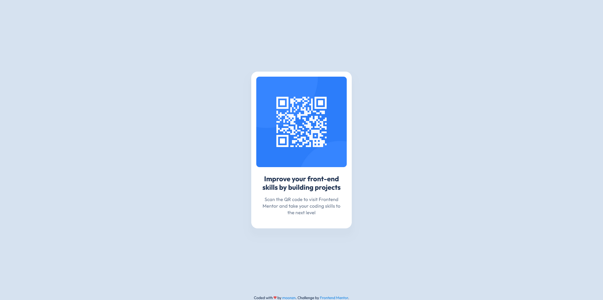

# Frontend Mentor - QR code component solution

This is a solution to the [QR code component challenge on Frontend Mentor](https://www.frontendmentor.io/challenges/qr-code-component-iux_sIO_H). Frontend Mentor challenges help you improve your coding skills by building realistic projects. 

## Table of contents

- [Overview](#overview)
  - [Screenshot](#screenshot)
  - [Links](#links)
- [My process](#my-process)
  - [Built with](#built-with)
  - [What I learned](#what-i-learned)
  - [Continued development](#continued-development)
  - [Useful resources](#useful-resources)
- [Author](#author)

## Overview

### Screenshot

### Links

- Solution URL: [Add solution URL here](https://github.com/moonzn/frontendmentor-qr-code-component)
- Live Site URL: [Add live site URL here](https://moonzn.github.io/frontendmentor-qr-code-component/)

## My process

I just used the basic knowledge I got from University to build this component. It's my first time using a CSS style file believe it or not, since I always avoided Frontend development.

I didn't build the HTML first and then the CSS, which maybe would've helped. I'm still trying to develop a workflow to develop for the Frontend.

I used Google to figure out the specific properties I wanted to alter to get the look I wanted.

### Built with

- Semantic HTML5 markup
- CSS properties
- Flexbox

### What I learned

I learned about the position property which helped a lot.

I did my best to organize the content and had to use the z-index property which I don't know if it was needed.

### Continued development

I want to focus on structuring my CSS in a cleaner way, with generic styles. I still need to learn some of the best practices.

I also think I should build the HTML first and then add style with CSS.

### Useful resources

- [Example resource 1](https://www.w3schools.com/) - For CSS examples.

## Author

- Frontend Mentor - [@yourusername](https://www.frontendmentor.io/profile/moonzn)